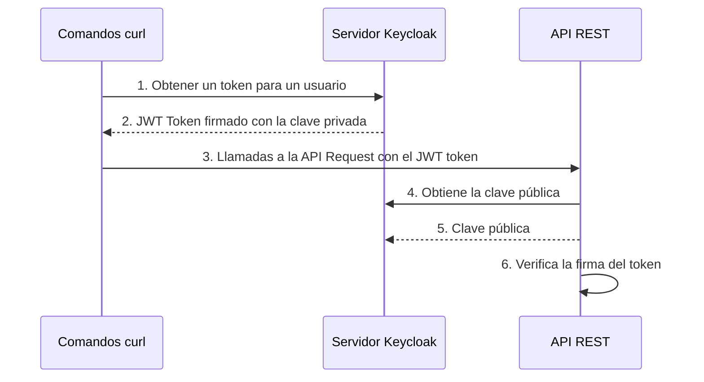

# Universidad Católica del Uruguay

## Facultad de Ingeniería y Tecnologías

### Análisis y diseño de aplicaciones II

 

# Demo de seguridad

Esta demo tiene una [aplicación web](./main.py) que expone una API REST; está
implementada en Python usando [fastapi](https://fastapi.tiangolo.com) y la
ejecutamos con [uvicorn](https://www.uvicorn.org).

La API tiene algunos endpoints de acceso público y otros con diferentes
requerimientos de seguridad, que usan JSON Web Token o JWT. Estos tokens
permiten crear datos con firma o cifrado opcional, cuyo contenido —payload— es
un JSON que afirma ciertos datos —claims—. Los tokens se firman usando un
secreto privado o una clave pública/privada.

El proveedor de tokens es [Keycloak](https://www.keycloak.org/). La API obtiene
la clave pública de Keycloack y luego usa esa clave para validar que las
repuestas cifradas que obtiene de Keycloack fueron firmadas con la
correspondiente clave privada y también para descrifrar esas respuestas.

Para ejecutar esta demo usa los comandos que están [aquí](./commands.azcli). Con
el complemento [Azure CLI
Tools](https://marketplace.visualstudio.com/items?itemName=ms-vscode.azurecli)
es posible ejecutar los comandos directamente desde Visual Studio Code.

Una vez que ejecutes la aplicación, puedes ver la documentación de los endpoints
con [Swagger](http://localhost:5003/docs).

# Requisitos

* Python

* Docker

# Actividades

Analiza cómo se implementan en esta demo los siguientes conceptos:

* Confidencialidad: algunos endpoints que solo puede ser accedidos por usuarios
  autenticados y con un rol específico.

* Integridad: cómo asegurar que los datos no hayan sido modificados.

* No-repudio: cómo se registran las acciones de los usuarios mediante logs o
  inmutables.

* Rendición de cuentas: cómo se registra el historial de acciones de los
  usuarios usuario autenticado.

* Autenticidad: algunos endpoints retornan la identidad de los usuarios
  autenticados.
